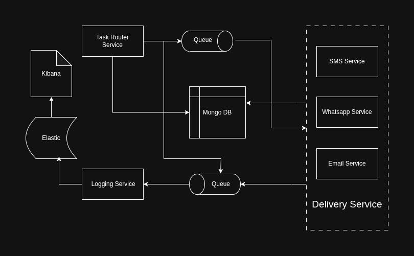

# Communication Aggregator System
## Overview
This system is made up of three core microservices that work together to receive messages, route them, deliver them through different channels, and record everything for observability. These microservices are:

1. Task Router Service
2. Delivery Services (Email, SMS, WhatsApp)
3. Logging Service

When a message is submitted, the Task Router validates it, makes sure it's not a duplicate, saves it to MongoDB, and routes it into RabbitMQ. The Delivery workers pick it up from their respective queues, attempt delivery with retries, and log every step. The Logging service collects logs from all services and writes them to Elasticsearch (or MongoDB if Elasticsearch is not available). Kibana is used to view the logs.

## High-Level Architecture


## Ports
1. Task Router: 3000
2. Delivery – Email: internal worker
3. Delivery – SMS: internal worker
4. Delivery – WhatsApp: internal worker
5. Logging Service: 3002
6. MongoDB: 27017
7. RabbitMQ: 5672 (AMQP), 15672 (Dashboard)
8. Elasticsearch: 9200
9. Kibana: 5601

## How to Start Everything

1. Clone the repository: 
```git clone https://github.com/Sumitbansal-01/Communication_Aggregator_System.git```
2. Move into the project folder:
```cd Communication_Aggregator_System```
3. Start the whole system using Docker Compose:
```sudo docker-compose up --build -d```
4. Once everything is running, you can check:
    1. RabbitMQ Dashboard — http://localhost:15672
    2. Kibana — http://localhost:5601
    3. Elasticsearch — http://localhost:9200
    4. Task Router API — http://localhost:3000/api/v1/messages

## API Usage
All messages go through:
```POST /api/v1/messages```

Example:
```
{
"channel": "email",
"to": "user@example.com",
"subject": "Hello",
"body": "Email test",
"metadata": { "tag": "demo" }
}
```
## Postman Collection
You can use this collection to test the APIs quickly:

https://sumitbansalk198-9743981.postman.co/workspace/Sumit-Bansal's-Workspace~e80b29a9-7dc7-4cf8-85a2-c0a2fae0d903/collection/50452854-688f04b6-f9bb-41ef-9718-6195edee1d89?action=share&creator=50452854

## Project Structure
1. task-router/
2. delivery/
3. logging/
4. docker-compose.yml
5. README.md
